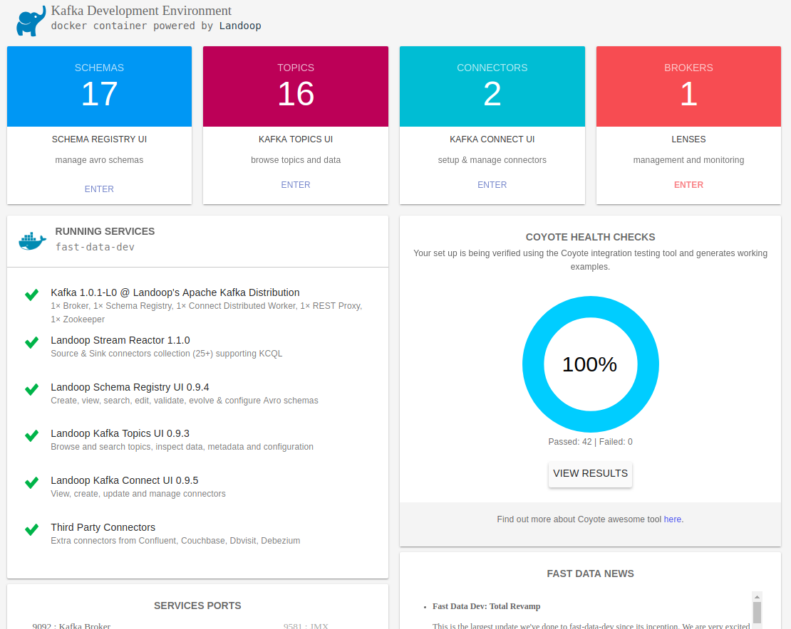
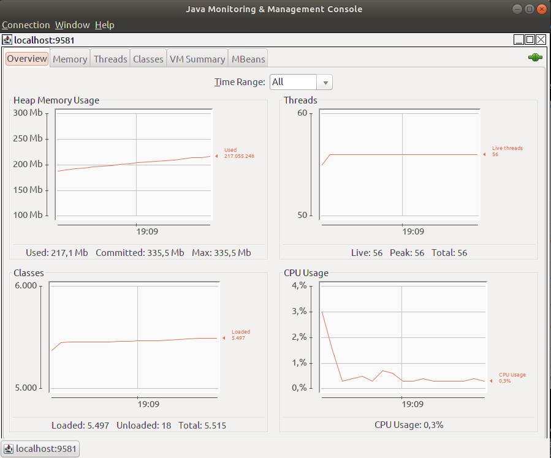
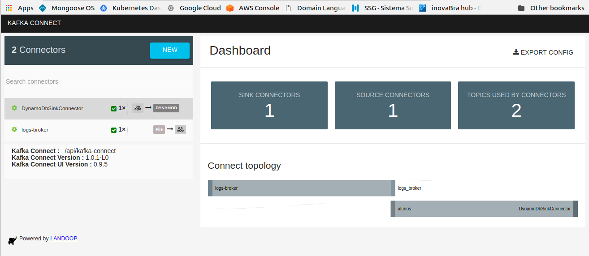
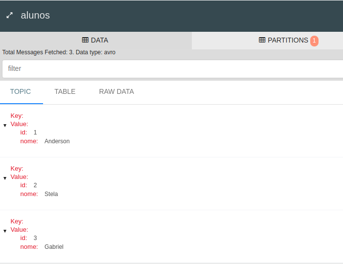

# Using kafka connect to sink to aws dynamodb

## Building the connector
Ref: <https://github.com/shikhar/kafka-connect-dynamodb>

Run `build-dyno-connect.sh`

or

```bash
git clone https://github.com/shikhar/kafka-connect-dynamodb.git kafka-connect-dynamodb

cd $PWD/kafka-connect-dynamodb

# Standalone
mvn -P standalone clean package
```

## Creating the dynamodb table
Go to [dynamoDB console](https://console.aws.amazon.com/dynamodb) and create `alunos` table.

## Starting kafka cluster for development
Ref: <https://github.com/Landoop/fast-data-dev>

```bash
start-kafka.sh
``` 
Follow start up progress through UI <http://localhost:3030/>



The default ports are:

* `9092` : Kafka Broker (9581 : JMX)
* `8081` : Schema Registry (9582 : JMX)
* `8082` : Kafka REST Proxy (9583 : JMX)
* `8083` : Kafka Connect Distributed (9584 : JMX)
* `2181` : ZooKeeper (9585 : JMX)
* `3030` : Web Server

An example of access the JMX console (java required): 

`jconsole localhost:9581`



or run docker directly

```bash
docker run \
 --rm \
 --name kafka
 --net:"host \
 -e ADV_HOST:"127.0.0.1 \
 -e RUNTESTS:"0 \
 -v $PWD/connect/kafka-connect-dynamodb/target/kafka-connect-dynamodb-0.3.0-SNAPSHOT-standalone.jar:/connectors/dynamodb.jar \
 landoop/fast-data-dev
```
After a minute or so, kafka is ready.

## Configuring the connector

Open the UI, and choose [Connectors](http://localhost:3030/kafka-connect-ui)



Hit the [New](http://localhost:3030/kafka-connect-ui/#/cluster/fast-data-dev/select-connector) button and copy and paste the following configuration:

Edit your aws credentials.

```ini
name=DynamoDbSinkConnector
connector.class=dynamok.sink.DynamoDbSinkConnector
topics=aluno
tasks.max=1
region=us-east-1
access.key.id=[your key with permission to put on dynamodb]
secret.key=[your secret key]]
ignore.record.key=true
```
> `connect-dynamo-config.ini` file

Hit [Create] if there is no red error messages.

Or use curl (or postman) to send the configuration:

```bash
curl -X POST \
  http://localhost:3030/api/kafka-connect/connectors \
  -H 'Content-Type: application/json' \
  -H 'Accept: application/json' \
  -d '{
  "name": "DynamoDbSinkConnector",
  "config": {
    "name": "DynamoDbSinkConnector",
    "connector.class": "dynamok.sink.DynamoDbSinkConnector",
    "topics": "aluno",
    "tasks.max": 1,
    "region": "us-east-1",
    "access.key.id": "[your key with permission to put on dynamodb]",
    "secret.key": "[your secret key]]",
    "ignore.record.key": "true"
  }
}'
```

## Pruducing some messages

```bash
docker exec -it kafka bash
```
Inside the container run:

```bash
# Producer
kafka-avro-console-producer --broker-list localhost:9092 --topic alunos --property value.schema:"'{"type":"record","name":"aluno","fields":[{"name":"id","type":"string"},{"name":"nome", "type": "string"}]}'"

# Copy and paste
{"id":"1","nome":"Anderson"}
{"id":"2","nome":"Stela"}
{"id":"3","nome":"Gabriel"}

# Consumer
kafka-avro-console-consumer --bootstrap-server localhost:9092 --topic alunos --from-beginning
```

Go to Dynamodb table, tab Itens to see your records.

> If something goes wrong, check the Connector UI, hit on DynamoDbSinkConnector and TASKS to see the log.



## Let's talk about topics

After configure the connector, it'll create the topic listed on topics key at config. If you need to customize this topic (for instance, to match number of tasks) use the kafka-topic command before or after configure the connector.

```bash
# Create topic
kafka-topic --zookeeper localhost:2181 --topic alunos --partitions 1 --replication-factor 1
```

Enjoy!!